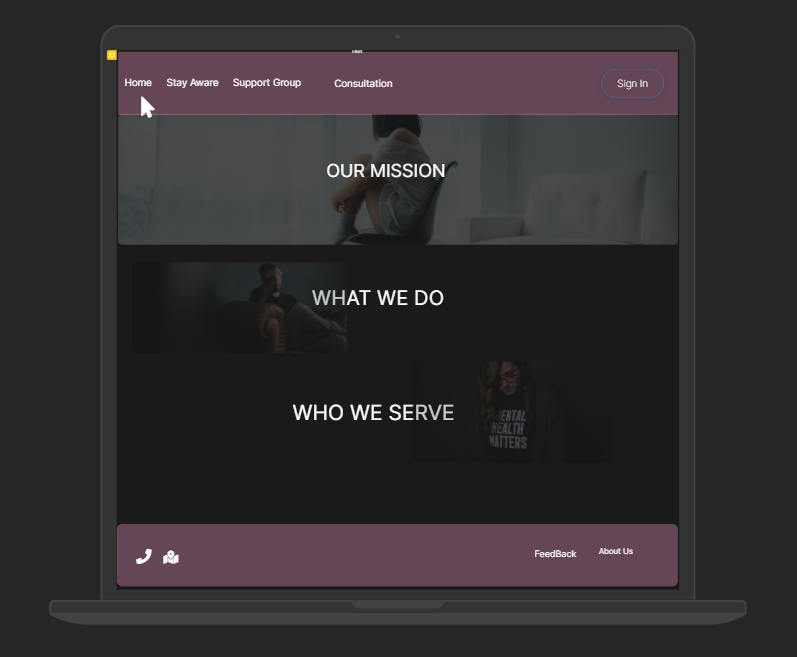
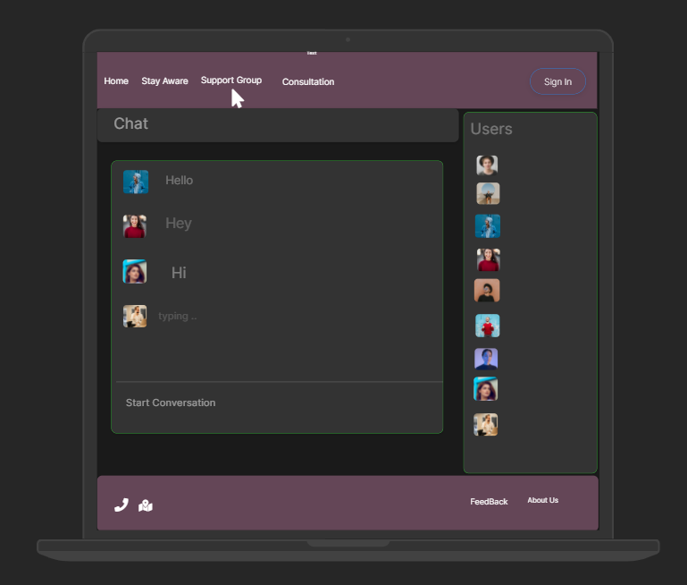
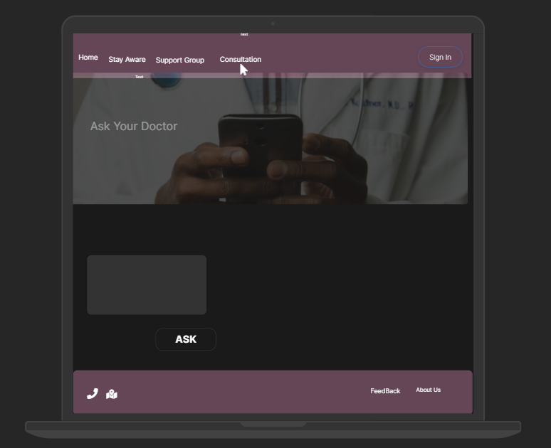
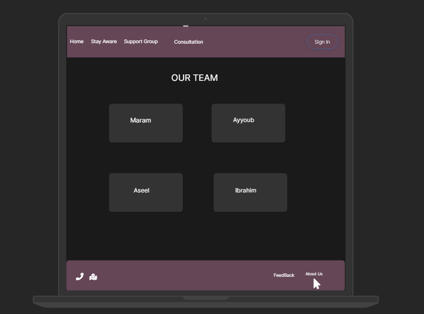
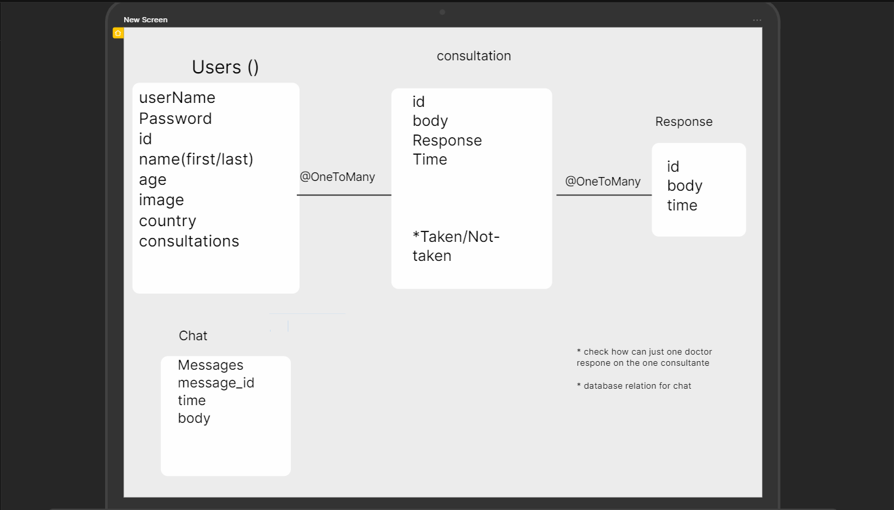
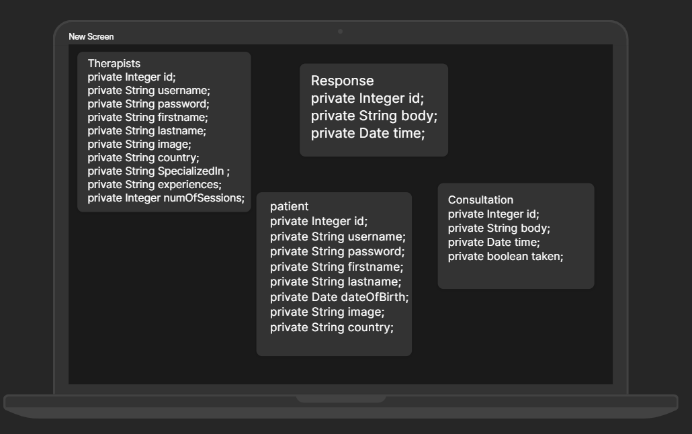

# Mental-HealthCare

## Description About Our Project:
- we are a web application support Mental-health Care issues,
 we do our best to aware people about mental health, and help people via let them ask  for a help when they need it. 
we  provide a consultations for free for patiant by a very qualified therapists,  and also we have a support group to provide interaction between users and to help them to get better. 

### Our Team Member:
- Maram Mustafa
- Aseel Dweedar
- Ayyoub AlKayyyam
- Ibrahim Alhamshari

## Team Agreement

 **Conflict Plan**

- What will your group do when it encounters conflict? 
We will try to solve it between us. by knowing the reason and giving a logical solution. If it doesn't work, we will put the TA in the situation.

- How will you raise concerns to members who are not adequately contributing?
We will try to know his reasons and make him aware of the consequences. If it doesn't work we will tell the instructor about him.

- What is your process to resolve conflicts?
make a meeting with the team members to know the reason and give a logical solution. If it doesn't work, we will put the TA in the situation.

- How and when will you escalate the conflict if your attempts are unsuccessful?
When we failed to solve it between us.
 
**Communication Plan**

- What hours will you be available to communicate?
We decide working hours for the next day and we communicate at these hours.

- What platforms will you use to communicate (ie. Slack, phone …?
Till this moment we use Slack, Zoom, and Discord.

- How often will you take breaks?
Not too much during the day. about a half an hour every four working hours.

- What is your plan if you start to fall behind?
Duplicate our effort and increase working hours. also divide the topics into priority, important, and less important.

- How will you communicate after hours and on the weekend?
Slack, Zoom, and Discord.

- What is your strategy for ensuring everyone’s voice is heard?
Take's everyone's opinion before any step.

- How will you ensure that you are creating a safe environment where everyone feels comfortable speaking up?
By listening to everybody in the group.
 
**Work Plan**

- How will you identify tasks, assign tasks, know when they are complete, and manage work in general?
By knowing the strengths and knowledge of the team members, allocate tasks accordingly, estimating the time needed to complete them, and making sure that the work is going according to plan.

- What project management tool will be used?
Inttilij, Git, VS code, wireframe.cc, Trello, colorhunt, and Github.
 
**Git Process**
- What components of your project will live on GitHub?
We started with making the structure and configuration files and every necessary work that we need to distribute the work and start with it. How will you share the repository 

- with your teammates?
We created our organization and created the project repository. and now it's ready to be cloned by every member.

- What is your Git flow?
Done by creating a sub-branch to bush all work on it. not in the main. Also, every member will work in a separate repository and push the work to the group repository after we make sure it's completely right.

## User Stories
- as a user (patient) i want to enter the web application that save my privacy 
- as a doctor i prefer to meet my patient online that keep people more comfortable
- as a user i prefer to find people to support me and understand what i suffer 
- as a doctor i prefer to serve people online thats enable me to serve and to get more consultation from patients 
- as a user i like the idea for chooes my doctor online thats provide more options for me 

## Software Requirements
* Vision: create a web application to support people whos need mental help 
* Scope (In/Out):
 - web application about mental-healthcare 
 - we have a alot of features to help pationt to get the best services 
 - we have a page to aware people about mental health and know more about mental-healthcare
 - we have support group to help pationt to get support from others pationt  
 - we have a part of consultation to get consultante from therapists
* Stretch : schadualing an appointment for specific user with specific therepist 

## WireFrame 

## Domain Modeling

## Make an Database Schema Diagram

